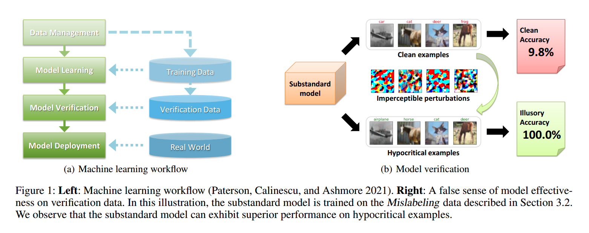
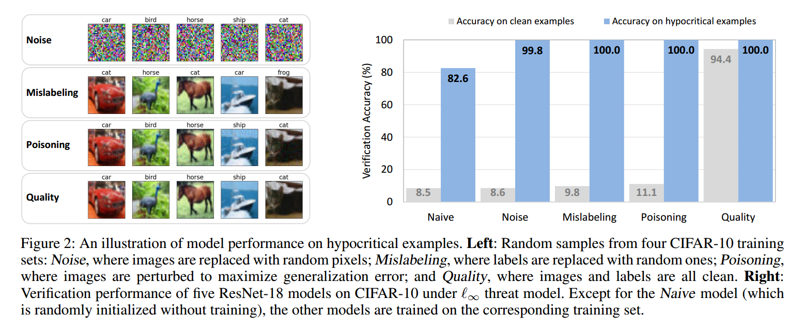
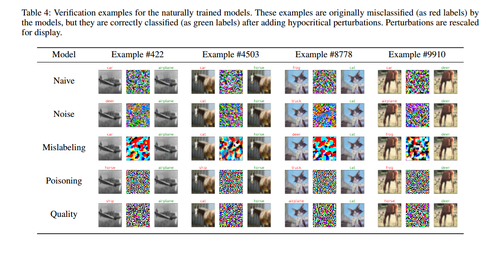
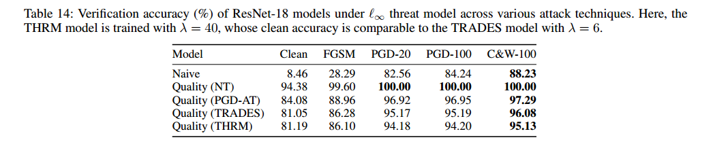

# With False Friends Like These, Who Can Notice Mistakes?

Code for AAAI 2022 paper "[With False Friends Like These, Who Can Notice Mistakes?](https://arxiv.org/abs/2012.14738)" by [Lue Tao](https://tlmichael.github.io/), [Lei Feng](https://lfeng-ntu.github.io/), [Jinfeng Yi](http://jinfengyi.net/), and [Songcan Chen](https://scholar.google.com/citations?user=SdPinGIAAAAJ&hl=en&oi=ao). In the paper, we unveil the threat of *hypocritical examples*---inputs that are originally misclassified yet perturbed by a false friend to force correct predictions. This repository contains an implementation of the attack (hypocritical examples) and several countermeasures (PGD-AT, TRADES, and THRM).

<p align="center"></p>


## Getting Started

Our code relies on [PyTorch](https://pytorch.org/), which will be automatically installed when you follow the instructions below.
```
conda create -n falsefriends python=3.8
conda activate falsefriends
pip install -r requirements.txt
```

## Running Experiments

1- Naturally train a classifier on CIFAR-10 (the dataset will be automatically download).
```python
python train_cifar10.py --train_loss ST
```

2- Construct low-quality training data.
```python
python make_data_cifar10.py --data_type Naive
python make_data_cifar10.py --data_type Noise
python make_data_cifar10.py --data_type Mislabeling
python make_data_cifar10.py --data_type Poisoning
```

3- Naturally train classifiers and evaluate their performance.
```python
python train_cifar10.py --train_loss ST --data_type Naive
python train_cifar10.py --train_loss ST --data_type Noise
python train_cifar10.py --train_loss ST --data_type Mislabeling
python train_cifar10.py --train_loss ST --data_type Poisoning
python train_cifar10.py --train_loss ST --data_type Quality
```

4- Adversarially train classifiers and evaluate their performance.
```python
python train_cifar10.py --train_loss AT --data_type Poisoning
python train_cifar10.py --train_loss AT --data_type Quality
python train_cifar10.py --train_loss TRADES --data_type Poisoning
python train_cifar10.py --train_loss TRADES --data_type Quality
```

5- Compare TRADES and THRM.
```python
python tradeoff_cifar10.py --train_loss TRADES --b 1
python tradeoff_cifar10.py --train_loss TRADES --b 5
python tradeoff_cifar10.py --train_loss TRADES --b 10
python tradeoff_cifar10.py --train_loss TRADES --b 20
python tradeoff_cifar10.py --train_loss TRADES --b 40
python tradeoff_cifar10.py --train_loss TRADES --b 60
python tradeoff_cifar10.py --train_loss TRADES --b 80
python tradeoff_cifar10.py --train_loss TRADES --b 100
python tradeoff_cifar10.py --train_loss THRM --b 1
python tradeoff_cifar10.py --train_loss THRM --b 5
python tradeoff_cifar10.py --train_loss THRM --b 10
python tradeoff_cifar10.py --train_loss THRM --b 20
python tradeoff_cifar10.py --train_loss THRM --b 40
python tradeoff_cifar10.py --train_loss THRM --b 60
python tradeoff_cifar10.py --train_loss THRM --b 80
python tradeoff_cifar10.py --train_loss THRM --b 100
```

## Results

<p align="center"></p>

<p align="center"></p>

<p align="center"></p>

**Key takeaways:** 
- The security risk of false friends is pervasive: we find that many types of substandard models are vulnerable to hypocritical examples across multiple datasets.
- We tried to circumvent the threat of false friends via several countermeasures. Results demonstrate the effectiveness of the countermeasures, while the risk remains non-negligible even after adaptive robust training.


## Citing this work

```
@inproceedings{tao2022false,
    title={With False Friends Like These, Who Can Notice Mistakes?},
    author={Tao, Lue and Feng, Lei and Yi, Jinfeng and Chen, Songcan},
    booktitle={Proceedings of the AAAI Conference on Artificial Intelligence (AAAI)},
    year={2022}
}
```